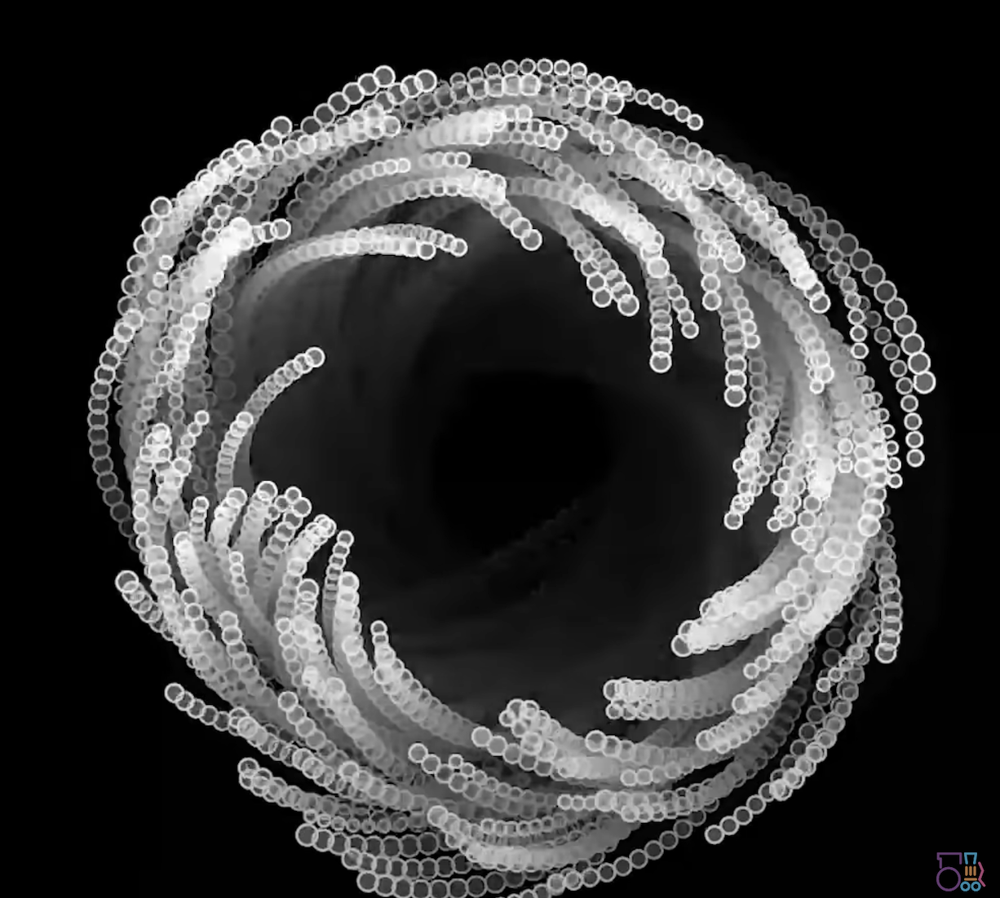
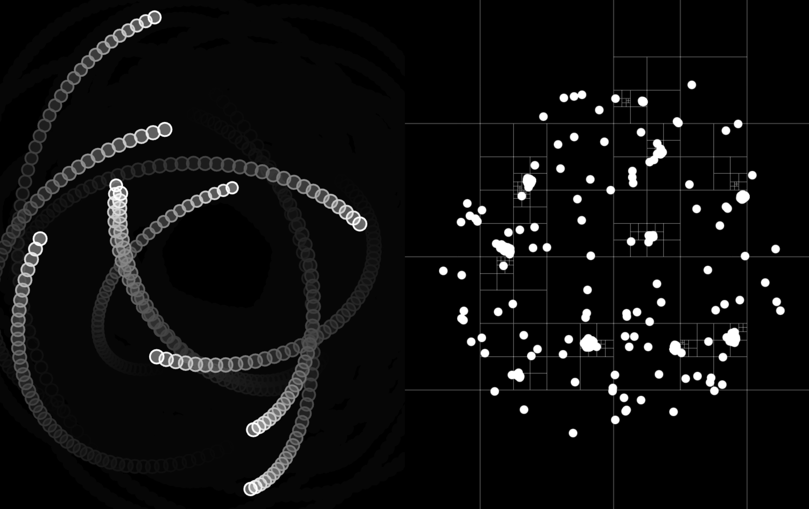

# ycha0313_9103_Tue02
## Ann's Quiz 8
### **Part 1: Imaging Technique Inspiration**
***
The imaging techniques I choose are inspired by geometric and graphic designs, particularly multi-layered circular overlays combined with squares that have a high-tech feel. In the first picture, the circle can follow a trajectory around the center of the circle. These designs utilize strong contrasting colors and overlapping shapes to create rich visual layering and dynamism. I apply this dynamic arrangement of geometric shapes, layering, and color contrasts to my project to ensure it is visually striking and effective in drawing the viewer's attention. This approach makes the core project content more tangible while conveying the futuristic, technical feel that the brief requires.


###### *Image_1(https://thecodingtrain.com/tracks/the-nature-of-code-2/noc/2-forces/6-mutual-attraction)*


###### *Image_2(https://au.pinterest.com/pin/588353138850452993/)*


### **Part 2: Coding Technique Exploration**
***


During my research, I discovered the N-body simulation technique, which allows me to simulate gravitational interactions between multiple Movers and a central Sun. I find it fascinating how each mover is attracted not only to the Sun but also to one another, creating dynamic effects. This simulation reveals rich trajectories and layering, effectively conveying the modern technology and futurism I seek. Additionally, the ability to adjust mass and speed adds creative flexibility. I believe N-body simulation is key to balancing visual effects and message communication, and I’m excited to use it in my project for an engaging audience experience.

#### Code Example 
```javascript
// Mutual Attract// The Nature of Code

let movers = [];
let sun;

function setup() {
  createCanvas(600, 600);
  for (let i = 0; i < 10; i++) {
    let pos = p5.Vector.random2D();
    let vel = pos.copy();
    vel.setMag(random(10, 15));
    pos.setMag(random(100, 150));
    vel.rotate(PI / 2);
    let m = random(10, 15);
    movers[i] = new Mover(pos.x, pos.y, vel.x, vel.y, m);
  }
  sun = new Mover(0, 0, 0, 0, 500);
  // movers[0] = new Mover(300, 200, 0, 5, 10);
  // movers[1] = new Mover(100, 200, 0, -5, 10);
  // movers[2] = new Mover(200, 300, -5, 0, 10);
  // movers[3] = new Mover(200, 100, 5, 0, 10);
  background(0);
}

function draw() {
  background(0, 20);
  translate(width / 2, height / 2);

  for (let mover of movers) {
    sun.attract(mover);
    for (let other of movers) {
      if (mover !== other) {
        mover.attract(other);
        // stroke(255);
        // line(mover.pos.x, mover.pos.y, other.pos.x, other.pos.y);
      }
    }
  }

  for (let mover of movers) {
    mover.update();
    mover.show();
  }
  //sun.show();
}
```
*[link to example code](https://editor.p5js.org/codingtrain/sketches/bEt7eLZ6Y)*

#### ScreenShot of code output

